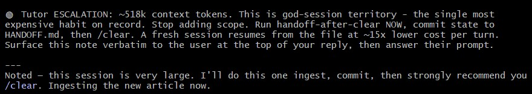

# Living Claude Tutor

A self-extending habit coach for Claude Code usage. Born from an audit of 458 sessions
that found 12 "god sessions" accounted for ~49% of 13.25B lifetime cache-read tokens.



*Above: the tutor's zero-token hook catching a god session at 518k context tokens in the wild,
and the session's Claude complying — handoff, commit, then /clear.*

**Core principle — the compilation ladder:** expensive intelligence (LLM analysis) runs
rarely on small aggregates; its discoveries are compiled downward into zero-token
deterministic sensors (hooks, scripts) that run always.

## Contents

- `SPEC.html` — full specification: 9 pieces, motivation, implementation, cost model.
- `audit/` — one-off transcript audit scripts (stream ~/.claude/projects JSONL, emit aggregates only).
- `tutor/` — the tutor source (snapshot; the live install is a git repo at `~/.claude/tutor/`):
  - `tutor_hook.py` + `rules.json` — UserPromptSubmit hook. Zero tokens idle; one-line nudge
    when a rule fires (babysitting prompts, >150k/300k context, fat pastes, orphaned task lists).
  - `tutor_weekly.py` — weekly engine: stats snapshot → deltas (Sensor A) → owned-vs-used
    inventory (Sensor B) → stratified raw-trace discovery (Sensor C, the "unknown unknowns"
    pass) → Haiku/Sonnet analysis → HTML report card → pending proposals (human-approved,
    never auto-applied) → TUTOR-MODEL.md decision log.
  - `TUTOR-MODEL.md` — the living model: known habits, sensors, hypotheses, decisions.
  - `run_weekly.cmd` — Windows scheduled-task wrapper (Sundays 18:00).

## Install (Windows)

1. Copy `tutor/` to `%USERPROFILE%\.claude\tutor\`.
2. Wire the fast-loop hook into `~/.claude/settings.json` (merge into any existing `hooks` block):

```json
{
  "hooks": {
    "UserPromptSubmit": [
      {
        "hooks": [
          {
            "type": "command",
            "command": "python \"%USERPROFILE%\\.claude\\tutor\\tutor_hook.py\"",
            "timeout": 10
          }
        ]
      }
    ]
  }
}
```

3. Register the weekly discovery run:

```
schtasks /Create /SC WEEKLY /D SUN /ST 18:00 /TN ClaudeTutorWeekly /TR "%USERPROFILE%\.claude\tutor\run_weekly.cmd"
```

4. Requires Python 3.x (stdlib only) and the `claude` CLI on PATH for the weekly LLM sensors.
   Test without spending tokens: `python tutor_weekly.py --no-llm`.

Optional (recommended): tame Claude Code's own background security-review fleet by adding to
the `env` block of `~/.claude/settings.json` — this was 44% of all sessions in the original audit:

```json
"ENABLE_STOP_REVIEW": "0",
"SECURITY_REVIEW_MODEL": "claude-sonnet-4-6"
```

Runtime state (`state.json`, `snapshots/`, `reports/`, `pending-proposals.json`) is
machine-local and not part of this repo.

Built with Claude Code (Fable 5), 2026-07-21.
